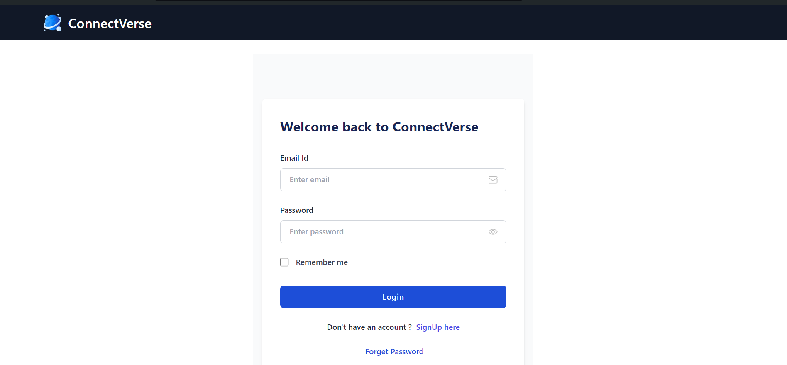

<a id="readme-top"></a>


<!-- PROJECT LOGO -->
<br />
<div align="center">
  <a href="https://github.com/othneildrew/Best-README-Template">
    
  </a>

  <h3 align="center">ConnectVerse</h3>

  <p align="center">
    Introducing Connect Verse ! Full stack MERN project
  </p>
</div>


<!-- TABLE OF CONTENTS -->
<details>
  <summary>Table of Contents</summary>
  <ol>
    <li>
      <a href="#about-the-project">About The Project</a>
      <ul>
        <li><a href="#built-with">Built With</a></li>
      </ul>
    </li>
    <li>
      <a href="#getting-started">Getting Started</a>
      <ul>
        <li><a href="#prerequisites">Prerequisites</a></li>
        <li><a href="#installation">Installation</a></li>
      </ul>
    </li>
    <li><a href="#contact">Contact</a></li>
  </ol>
</details>


<!-- ABOUT THE PROJECT -->
## About The Project



Developed JWT authentication system with following implementations

Details :
* Field validation and state management
* Remember me feature
* Proper error details with toast
* Enforced input validation and sanitization
* Securely stored passwords using hashing (bcrypt.js)
* Email verification using Resend
* JWT based token for authentication
* Robust token refresh mechanisms
* Protected routes to avoid unauthorized access to pages
* Forgot password
* Logout functionality
* 404 Page Not Found

  

<p align="right">(<a href="#readme-top">back to top</a>)</p>


### Built With

This section should list any major frameworks/libraries used for the project

* React Js
* Express Js
* Mongo Db
* Tailwind CSS
* Node Js

<p align="right">(<a href="#readme-top">back to top</a>)</p>


<!-- GETTING STARTED -->
## Getting Started

This is an example of how you may give instructions on setting up your project locally.
To get a local copy up and running follow these simple example steps.

### Prerequisites

This is an example of how to list things you need to use the software and how to install them.
* npm
  ```sh
  npm install npm@latest -g
  ```


### Installation
1. Clone the repo
   ```sh
   git clone https://github.com/Yash-Dabhade/ConnectVerse.git
   ```
2. All environment variables are provided in .env
3. Install NPM packages in client folder and start server
   ```sh
   cd client
   npm install

   npm start
   ```
3. Install NPM packages in client folder and start server
   ```sh
   cd server
   npm install
   npm install -d nodemon
   nodemon index.js
   ```
   
5. Go to the running server at localhost:3000 to run

<p align="right">(<a href="#readme-top">back to top</a>)</p>


<!-- CONTACT -->
## Contact

Yash Dabhade - dabhadeyash1111@gmail.com

